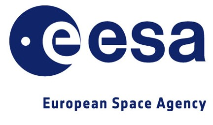

  
  

**Interactive Browser-Based Visualization Framework for Exploring Zarr Data Stores**

[![][docs-dev-img]][docs-dev-url]

 

 

)
 

[docs-dev-img]: https://img.shields.io/badge/docs-%20tutorial-orange?style=round-square
[docs-dev-url]: https://browzarr.io/latest/docs/

Browzarr is a powerful, browser-native framework for visualizing, exploring, and analyzing **Zarr data stores**.  
Load multi-dimensional datasets directly in the browser, interactively slice and inspect chunks, and gain insights without any backend or server setup.

---

> [!IMPORTANT]  
> 🌐 **Try it now at [browzarr.io](https://browzarr.io)**

Stay tuned - major updates and new visualization features are on the way! 🚀

> [!TIP]  
> 💡 _Have suggestions or feature requests? Feel free to open an issue or submit a PR!_

# Version 1.0.0 - Progress/Features
We are still in active development but plan to release a stable 1.0.0 when all of the desired features are in place and a final stability and bug pass has been completed
- [x] Temporal and spatial slicing
- [ ] Larger texture support
- [ ] NetCDF Support
- [ ] Customizable export
- [ ] Animation export
- [ ] Stability pass

## Acknowledgments & Funding

<table style="border-collapse: collapse; border: none; white-space: nowrap;">
<tr>
<td style="text-align: center; border: none;"></td>
<td style="text-align: center; border: none;"></td>
<td style="text-align: center; border: none;"><a href="http://seasfire.hua.gr/" target="_blank"></td>
<td style="text-align: center; border: none;"><a href="https://ai4pex.org" target="_blank"></td>
</tr>
</table>

- This project has received funding from the European Union's Horizon Europe research and innovation programme under grant agreement no. 101137682 (AI4PEX – Artificial Intelligence and Machine Learning for Enhanced Representation of Processes and Extremes in Earth System Models).

- This work builds on developments from the European Space Agency (ESA) SeasFire project, funded under the [ESA Future EO-1 Science for Society Call](https://eo4society.esa.int/projects/seasfire/), and supported by ESA’s Network of Resources Initiative. **Browzarr is not currently funded under this programme.**

_Funded by the European Union. The views expressed are those of the authors and do not necessarily reflect those of the European Union, the European Research Executive Agency or the European Space Agency. Neither granting authority can be held responsible for them._
